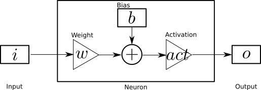

A nice and practical introduction to Artificial Neural Networks (ANN) can be found in Andrej Karpathy's blog ([1](http://karpathy.github.io/neuralnets/))

## Single Neuron

The equation representing a single neuron is

$$
o = act(w.i+b)
$$

where:
  * $$i$$ is the `input` 
  * $$w$$ and $$b$$ are respectively the `weight` and the `bias` of the neuron
  * $$act$$ is the `activation` function
  * $$o$$ is the `ouptut`

Neural Net peoples enjoy representing their toys with block diagrams. A neuron can be described by the following diagram: 
<figure>
  
  <figcaption>FigXXX - Single Neuron.</figcaption>
</figure>

### Activation Function
A whole range of activation functions are commonly used. The following plot ( created with this [code](https://github.com/poine/ann_elucubrations/blob/master/src/intro_activation.py) ) illustrate those available in keras.

<figure>
  
  <figcaption>FigXXX - Activation functions.</figcaption>
</figure>

### Effect of Weights and Biases
By varying the weight and bias of a neuron, one is able to change the shape of the input/output function of the neuron, as shown in figure (XXX) ( created with this [code](this https://github.com/poine/ann_elucubrations/blob/master/src/intro_weight.py) )
<figure>
  
  <figcaption>FigXXX - Weights.</figcaption>
</figure>

## Neural Network
Neurons are commonly organized in layers such as illustrated in figure (XXX).
The equation can be matricially summarized as:

Input and ouput can be multi dimensional (tensors)

Layers can be stacked into a network
<figure>
  
  <figcaption>FigXXX - Response of a dual layers network.</figcaption>
</figure>

## Network Fitting

### back propagation

## Examples

### Learning a sine
 [code](this https://github.com/poine/ann_elucubrations/blob/master/src/intro_learn_sine.py)
 
<figure>
  
  <figcaption>FigXXX - identity activation.</figcaption>
</figure>

<figure>
  
  <figcaption>FigXXX - logistic activation.</figcaption>
</figure>

<figure>
  
  <figcaption>FigXXX - tanh activation.</figcaption>
</figure>

<figure>
  
  <figcaption>FigXXX - relu activation.</figcaption>
</figure>

### Bibliography

* (1) Andrej Karpathy,  Hacker's guide to Neural Networks [http://karpathy.github.io/neuralnets/](http://karpathy.github.io/neuralnets/)
