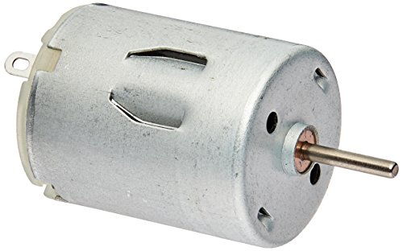

## DC motor

### Model
<figure>
	
	
	<figcaption>Fig1. - DC motor Picture (left) and Schematics (right).</figcaption>
</figure>

$$
X = \begin{pmatrix} \theta \\ \dot{\theta} \\ i \end{pmatrix}
$$

$$
 \frac{d}{dt}\begin{pmatrix} \theta \\ \dot{\theta} \\ i \end{pmatrix} = 
 \begin{pmatrix}  1 & 0 & 0 \\ 0 & -\frac{B}{J} & \frac{K}{J} \\ 0 & -\frac{K}{L} & -\frac{R}{L} \end{pmatrix}
 \begin{pmatrix} \theta \\ \dot{\theta} \\ i \end{pmatrix} +
 \begin{pmatrix} 0 \\ 0 \\ \frac{1}{L} \end{pmatrix} \begin{pmatrix} v \end{pmatrix} +
 \begin{pmatrix} 0 \\ -\frac{1}{J} \\ 0 \end{pmatrix} \begin{pmatrix} T_l \end{pmatrix}
$$

[code](https://github.com/poine/ann_elucubrations/blob/master/src/dc_motor.py)

### Bibliography

 * (1) [Adaptive Control of a DC Motor Using Neural Network Sliding Mode Control](http://www.iaeng.org/publication/IMECS2009/IMECS2009_pp1203-1207.pdf), M.Fallahi and S.Azadi,
 * (2) [Control Tutorial](http://ctms.engin.umich.edu/CTMS/index.php?example=MotorSpeed&section=SystemModeling), University of Michigan
