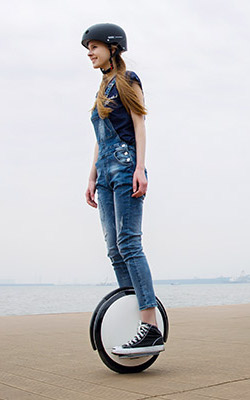

# Mobile Inverted Pendulum

## Simple Planar Model

$$ \RR $$

<figure>
	
	
  <figcaption>Fig1. - Planar MIP Picture (left) and Schematics (right).</figcaption>
</figure>

[code](https://github.com/poine/ann_elucubrations/blob/master/src/mip_simple.py)

The derivation of a space state equation is adapted from \cite{ostovari2014}
### Notations
  * $$m_w$$, $$m_b$$, $$I_w$$, $$I_b$$: respectively wheel and body masses and inertias
  * $$L$$: distance between wheel axis and body center of mass
  * $$R$$: wheel radius
  * $$\theta$$: angle between vertical and body axis
  * $$\phi$$: angle between horizontal and the wheel
  * $$x$$: horizontal coordinate of the wheel axis

### Kinematics

Position of the body center of mass:
$$\begin{equation}
  \vect{r} = \begin{pmatrix}x-L\sin{\theta} \\ R+L\cos{\theta}\end{pmatrix}
\end{equation}$$

Velocity of the body center of mass:
$$\begin{equation}
  \dot{\vect{r}} = \begin{pmatrix}\dot{x}-L\dot{\theta}\cos{\theta} \\ -L\dot{\theta}\sin{\theta}\end{pmatrix}
\end{equation}$$

Acceleration of the body center of mass:
$$\begin{equation}
  \ddot{\vect{r}} = \begin{pmatrix}
    \ddot{x}-L\ddot{\theta}\cos{\theta} + L \dot{\theta}^2\sin{\theta}\\
    -L\ddot{\theta}\sin{\theta} - L \dot{\theta}^2 \cos{\theta} \end{pmatrix}
\end{equation}$$

The \emph{no slip} hypothesis also brings:
$$\begin{equation}
  x = -R \phi
\end{equation}$$

### Dynamics

\begin{enumerate}
\item Angular acceleration of the wheel
  \begin{equation}
    I_w \ddot{\phi} = \tau - F R
  \end{equation}
\item Linear acceleration of the wheel
  \begin{equation}
    m_w \begin{pmatrix} \ddot{x} \\ 0 \end{pmatrix} = \begin{pmatrix}-P_x - F \\ N - P_y -m_w g \end{pmatrix}
  \end{equation}
\item Angular acceleration of the body
   \begin{equation}
    I_b \ddot{\theta} = -\tau + P_y L \sin{\theta} + P_x L \cos{\theta}
   \end{equation}
 \item Linear acceleration of the body
   in $\vect{i}$ direction: \begin{equation} m_b (\ddot{x} -\dot{\theta}L\cos{\theta} + \dot{theta}^2 L \sin{\theta}) = P_x \end{equation}
\end{enumerate}

### State Space Equation

$$\begin{equation}
  (m_bRL\cos{\theta}) \ddot{\phi} + (I_b + m_bL^2) \ddot{\theta} = m_b g L \sin{\theta} - \tau
\end{equation}$$

\begin{equation}
  \left(I_w + (m_b+m_w)R^2\right) \ddot{\phi} + (m_b R L \cos{\theta}) \ddot{\theta}  = m_b R L \dot{\theta}^2 \sin{\theta} + \tau
\end{equation}
or matricially
\begin{equation}
  \begin{pmatrix}a & b \\ c & a \end{pmatrix} \begin{pmatrix}\ddot{\phi} \\ \ddot{\theta} \end{pmatrix} =
  \begin{pmatrix} d \\ e \end{pmatrix}
\end{equation}
with
\begin{equation}
  a = m_bRL\cos{\theta} \quad b = I_b + m_bL^2 \quad c = I_w + (m_b+m_w)R^2 
\end{equation}
and
\begin{equation}
  d = m_b g L \sin{\theta} - \tau \quad e =  m_b R L \dot{\theta}^2 \sin{\theta} + \tau
\end{equation}
When the system has full rank ($a^2-bc \ne 0$), equations can be separated, leading to
\begin{equation}
  \begin{pmatrix}\ddot{\phi} \\ \ddot{\theta} \end{pmatrix} =
  \frac{1}{a^2-bc}\begin{pmatrix}a & -b \\ -c & a \end{pmatrix}\begin{pmatrix} d \\ e \end{pmatrix}
\end{equation}
or
\begin{equation}
  \begin{pmatrix}\ddot{\phi} \\ \ddot{\theta} \end{pmatrix} =
  \frac{1}{a^2-bc}\begin{pmatrix} ad-be \\ -cd+ae\end{pmatrix}
\end{equation}
which expands to:
\begin{equation}
  \begin{cases}
    \ddot{\phi} = \\
    \ddot{\theta} =
  \end{cases}
\end{equation}

### References
\bibitem{ostovari2014} Saam Ostovari et al {\em The dynamics of a Mobile Inverted Pendulum (MIP)}  2014.
