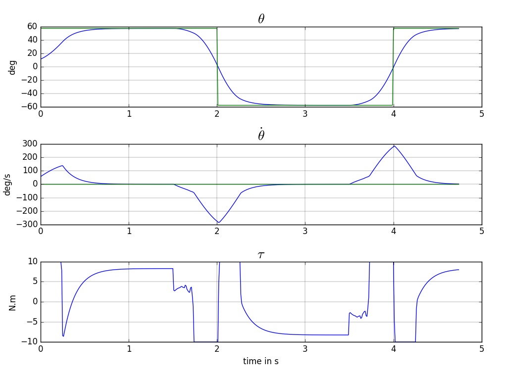
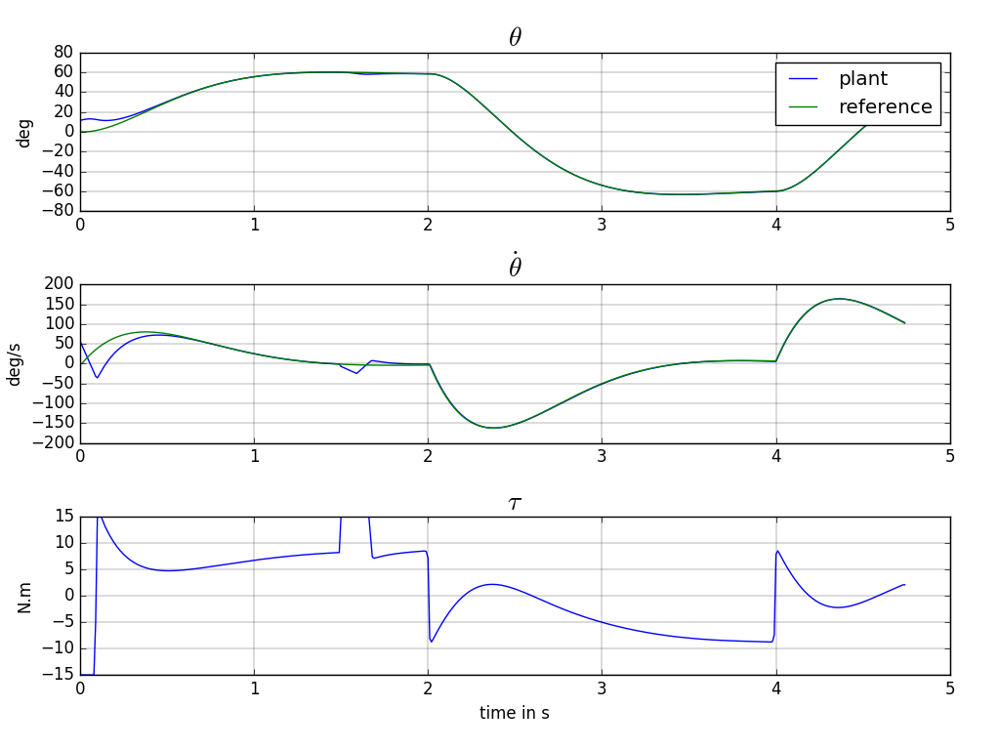
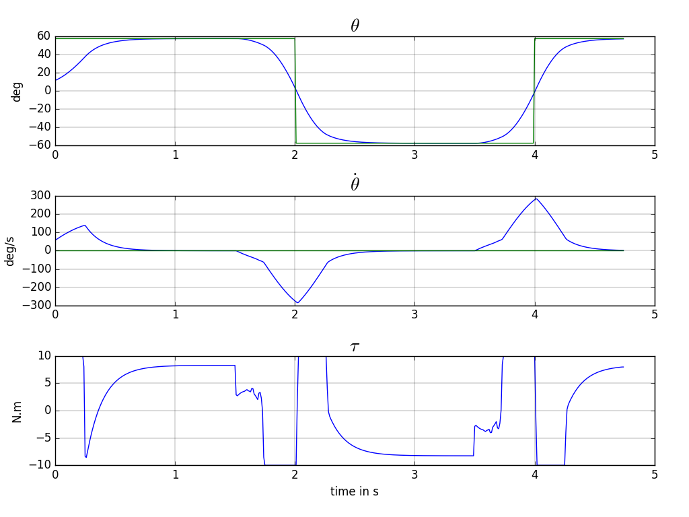

### With Perfect Continuous-Time Model

Figure (1) shows a simulation obtained with this [code](https://github.com/poine/ann_elucubrations/blob/master/src/mpc__robot_arm__1.py).

<figure>
  
  <figcaption>Fig1. - Robot Arm trajectory.</figcaption>
</figure>

### With Approximate Discrete-Time Model

[code](https://github.com/poine/ann_elucubrations/blob/master/src/mpc__robot_arm__2.py)

<figure>
  
  <figcaption>Fig2. - Robot Arm trajectory.</figcaption>
</figure>

### With ANN Model

[code](https://github.com/poine/ann_elucubrations/blob/master/src/mpc__robot_arm__3.py)

<figure>
  
  <figcaption>Fig2. - Robot Arm trajectory.</figcaption>
</figure>

