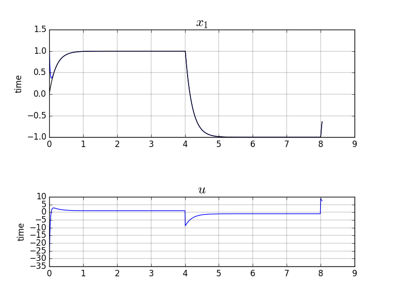

Plant:

$$
x_{k+1} = a.x_k + b.u_k
$$

Reference:

$$
x^r_{k+1} = a_r.x^r_k + b_r.x^{sp}_k
$$

Tracking_error:

$$
\epsilon_{k+1} = a_\epsilon .\epsilon_k
$$

control law:

$$
u_k = \frac{1}{b}  x^r_{k+1} -\frac{a_\epsilon}{b}   x^r_k + \frac{a_\epsilon - a}{b} x_k
$$

[keras code](https://github.com/poine/ann_elucubrations/blob/master/src/mrc__fo_lti.py)

<figure>
  
  <figcaption>Fig1. - .</figcaption>
</figure>
