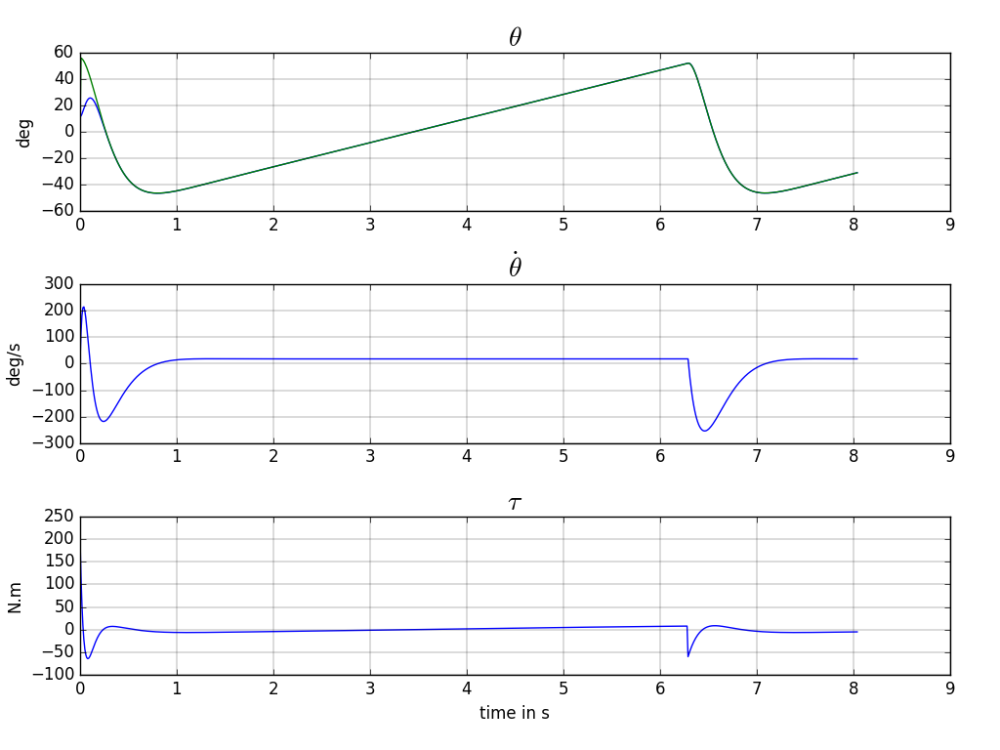

In first approximation, [Robot Arm](robot_arm.html) is a second order, nonlinear, time invariant plant 

[keras code](https://github.com/poine/ann_elucubrations/blob/master/src/mrc__robot_arm.py)

<figure>
  
  <figcaption>Fig1. - .</figcaption>
</figure>
<figure>
  
  <figcaption>Fig2. - .</figcaption>
</figure>
<figure>
  
  <figcaption>Fig3. - .</figcaption>
</figure>
