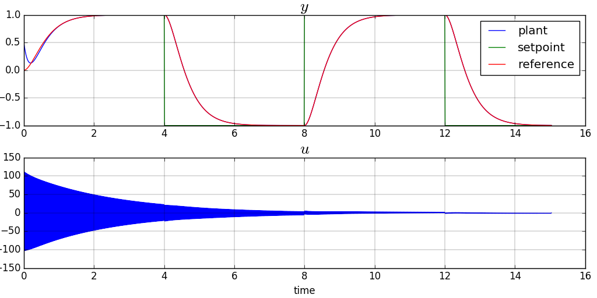

<script src="https://cdn.mathjax.org/mathjax/latest/MathJax.js?config=TeX-AMS-MML_HTMLorMML" type="text/javascript">
MathJax.Hub.Config({
  TeX: { equationNumbers: { autoNumber: "AMS" } }
});
</script>


## Input/Ouput Feedback Linearization Control


### 1: Derivation of the Control Law
Recall that we have [trained a neural network](plant_id__so_lti.html) to identify our plant under control affine form:

$$\begin{equation}
y_{k+1} = f(y_k, y_{k-1}, u_{k-1}) + g(y_k, y_{k-1}, u_{k-1}).u_k
\end{equation}\label{eq:plant}$$

Let our control objective be to follow a stable linear reference trajectory $$y^r$$ driven by input $$y^{sp}$$ such as:

$$\begin{equation}
y^r_{k+1} = -b^r_{1}.y^r_k -b^r_{0}.y^r_{k-1} + a^r_{1}.y^{sp}_{k} + a^r_{0}.y^{sp}_{k-1}
\end{equation}\label{eq:reference}$$

while the tracking error $$\epsilon = y - y^r$$ is rejected with a stable linear dynamics such as:


$$\begin{equation}
\epsilon_{k+1} = -b^e_1.\epsilon_{k} -b^e_{0}.\epsilon_{k-1}
\end{equation}\label{eq:track_err}$$


Replacing $$y_{k+1}$$ in $$\eqref{eq:track_err}$$ with the expression from $$\eqref{eq:plant}$$ and rearanging leads to the expression of the control law as:

$$\begin{equation}
u_k = \frac{1}{g(y_k, y_{k-1}, u_{k-1})} \left( y^r_{k+1} - f(y_k, y_{k-1}, u_{k-1}) -b^e_{1}.\epsilon_{k} -b^e_{0}.\epsilon_{k-1} \right)
\end{equation}\label{eq:ctl_law}$$

where $$y^r_{k+1}$$ is given by $$\eqref{eq:reference}$$ 

### 2: Simulation
The following [keras code](https://github.com/poine/ann_elucubrations/blob/master/src/nli__so_lti.py) implements the control law: the neural network layers obtained from the identification phase are loaded with:
```python
ann = keras.models.load_model(ann_filename+'.h5')
_fl, _gl = [ann.get_layer(name=_n) for _n in ['f', 'g']]
LOG.info('f: {} g: {}'.format(_fl.get_weights(), _gl.get_weights()))
_i = keras.layers.Input(shape=(3,)) # x_km1, x_km2, u_km2
self.f = keras.models.Model(inputs=_i, outputs=_fl(_i))
self.g = keras.models.Model(inputs=_i, outputs=_gl(_i))
```

The control law is then implemented as:
```python
def get(self, yc_k, y_k, y_km1, u_km1):
    _i = np.array([[y_k, y_km1, u_km1]])
    _f, _g = [_m.predict(_i) for _m in [self.f, self.g]]
    yr_k, yr_km1, yr_kp1 = self.ref.y_k, self.ref.y_km1, self.ref.get(yc_k)
    e_k, e_km1 = y_k - yr_k, y_km1 - yr_km1
    u_k = (yr_kp1 -_f -self.be1*e_k -self.be0*e_km1)/_g
    return yr_kp1, u_k
```		

Figure 1 represents a simulated step response trajecory of the controlled plant. It can be seen that the plant is accurately tracking the reference and rejecting perturbations but that the control input is exhibiting unacceptable chattering, typical to this type of control.

The usability, i.e. the way this chattering would be filtered, or on the contrary excite unmodeled dymanics on a real plant needs to be assessed on a case per case basis.
<figure>
  
  <figcaption>Fig1. - SO LTI step response under NLI control.</figcaption>
</figure>


## Full State Feedback Linearization Control

### 1: Derivation of the Control Law

Recall that we have [trained a neural network](plant_id__so_lti.html#ctaf_fs) to identify our plant under control affine form:

$$\begin{equation} X_{k+1} = f(X_k) + g(X_k).U_k \end{equation}$$

Let out control objectif be to follow a linear stable reference trajectory $$X^r$$ driven by input $$X^{sp}$$ such as:

$$\begin{equation}
X^r_{k+1} = A_r. X^r_{k} + B_r. X^{sp}_{k}
\end{equation}$$

while the tracking error $$\epsilon = X - X^r$$ follows a stable linear dynamics such as:

$$\begin{equation}
\epsilon_{k+1} = A_{\epsilon}.\epsilon_{k}
\end{equation}\label{eq:fs_track_err}$$


