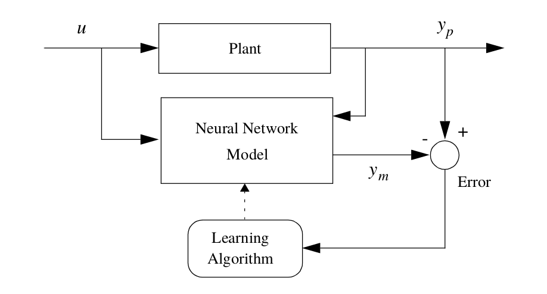

# Plant identification

In control systems, a plant is usually modeled by an ordinary differential equation

$$
\dot{X} = f_c(X, U)
$$

where $$X \quad C^1:\mathbb{R} -> \mathbb{R}^n$$ is the *state* of the system and $$U \quad C^0:\mathbb{R} -> \mathbb{R}^m$$ is its *input*

When working with digital systems, it is common practice to discretize the above continuous-time model by considering the input $$U$$ to be constant on the time interval $$[t, t+dt]$$ and use a difference equation like

$$
X_{k+1} = f_d(X_k, U_k)
$$

As a universal function approximator, an Artificial Neural Networks (ANN) can be trained to approximate the plant's dynamics.

<figure>
  
  <figcaption>Fig1. - Input-Output Plant Identification.</figcaption>
</figure>

### Input/Output identification

NARMA model

$$
  y_{k+d} = h\left( y_k, y_{k-1} \dots y_{k-n}, u_k, u_{k-1} \dots u_{k-m} \right)
$$

Control-Affine model

$$
  y_{k+d} = h\left( y_k, y_{k-1} \dots y_{k-n}, u_{k-1} \dots u_{k-m} \right) + g\left( y_k, y_{k-1} \dots y_{k-n}, u_{k-1} \dots u_{k-m} \right).u_k
$$

## Examples

  * [First Order LTI](plant_id__fo_lti.html)

  * [Second Order LTI](plant_id__so_lti.html)

  * [Electric DC motor](plant_id_dc_motor.html)

  * [Robot Arm](plant_id_robot_arm.html)

  * [Mobile Inverted Pendulum](plant_id_mip.html)

