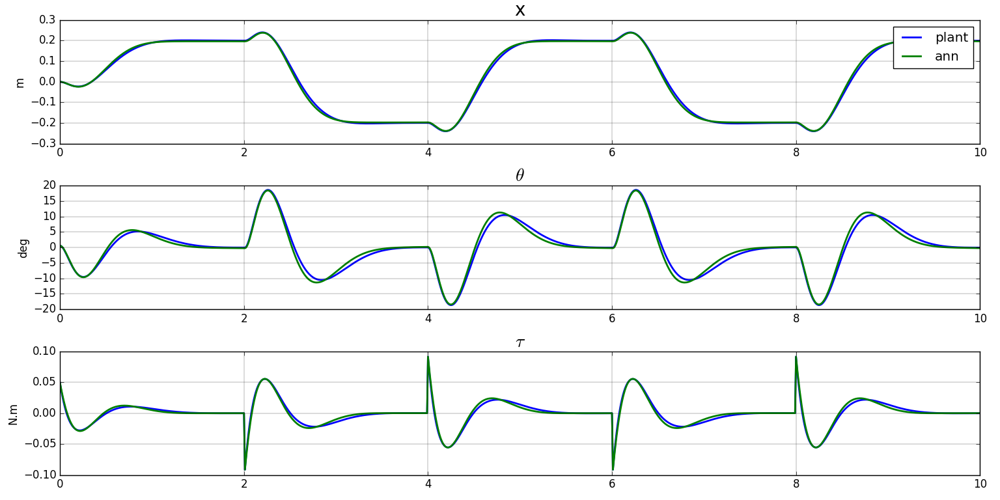

[MIP](mip.html)

Here, the plant is instable: MIP will trip unless activelly controlled. We can not obtain a training dataset in open loop.

## First experiment

In this first experiment, the dataset used for the training is obtained by simulating MIP under the control of a linear regulator, as could be done on a real robot. 

  * As a preamble, a linear state feedback regulator is synthetized. It is then used to generate a training set by feeding a random setpoint to the regulator.
  
<figure>
  
  <figcaption>Fig1. - Training trajectory.</figcaption>
</figure>

An histogram of the training dataset shows that the resulting distributions are far from uniform.

<figure>
  
  <figcaption>Fig2. - Histogram of the training trajectory.</figcaption>
</figure>

  * A neural network with a single 4 neurons layer and a linear activation is then trained with a batch size of 32 during 35 epochs.
 
<figure>
  
  <figcaption>Fig2. - Chronogram of the neural network training.</figcaption>
</figure>
  
  * The netork is validated with the regulator on a step input and shows that the behaviour of the MIP is globally captured

<figure>
  
  <figcaption>Fig1. - MIP test trajectory, FS plant identification.</figcaption>
</figure>

## Second experiment

We now generate a uniform training dataset
<figure>
  
  <figcaption>Fig2. - Histogram of the training trajectory.</figcaption>
</figure>
 
 * The same neural network with a single 4 neurons layer and a linear activation is then trained with a batch size of 32. Convergence happens faster (15 epochs).
 
<figure>
  
  <figcaption>fig2. - chronogram of the neural network training.</figcaption>
</figure>
  
  * the netork is validated with the regulator on a step input and shows that the behaviour of the mip is globally captured and a little bit better than with the previous training dataset 

<figure>
  
  <figcaption>Fig1. - MIP test trajectory, FS plant identification.</figcaption>
</figure>

[code](https://github.com/poine/ann_elucubrations/blob/master/src/plant_id__mip_simple.py)
