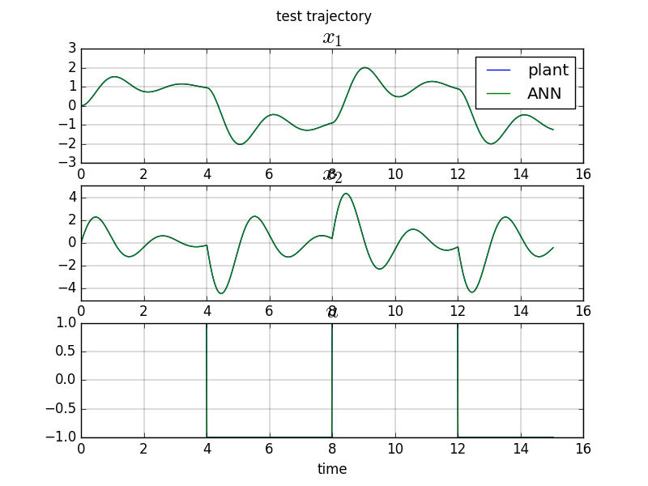
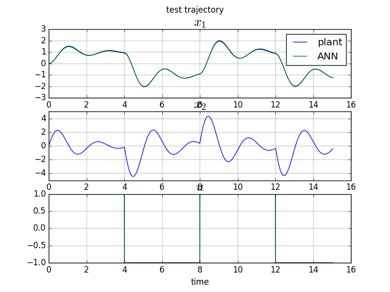
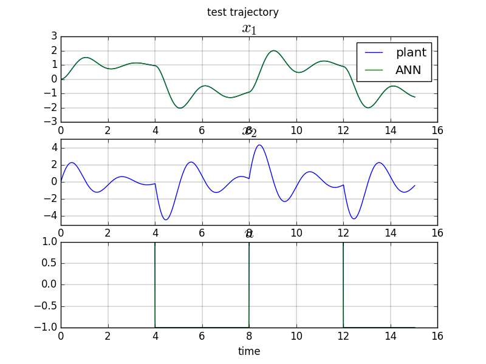
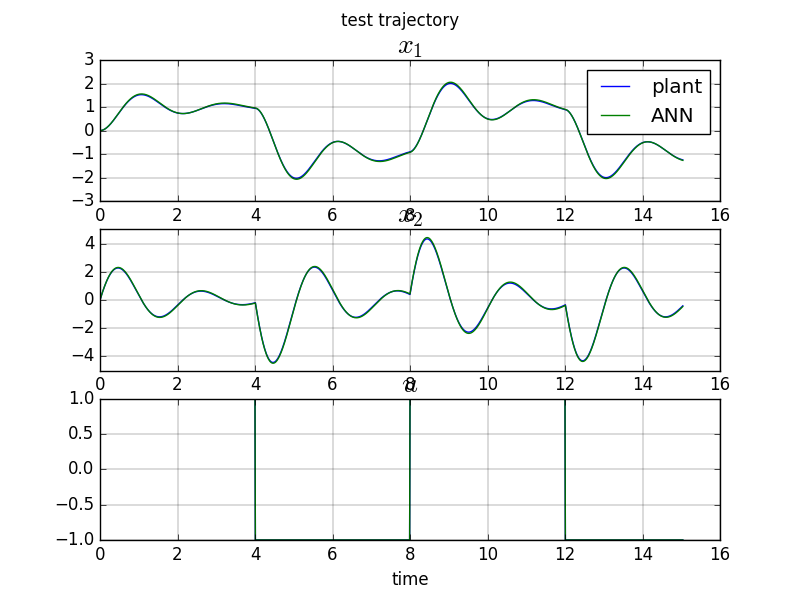
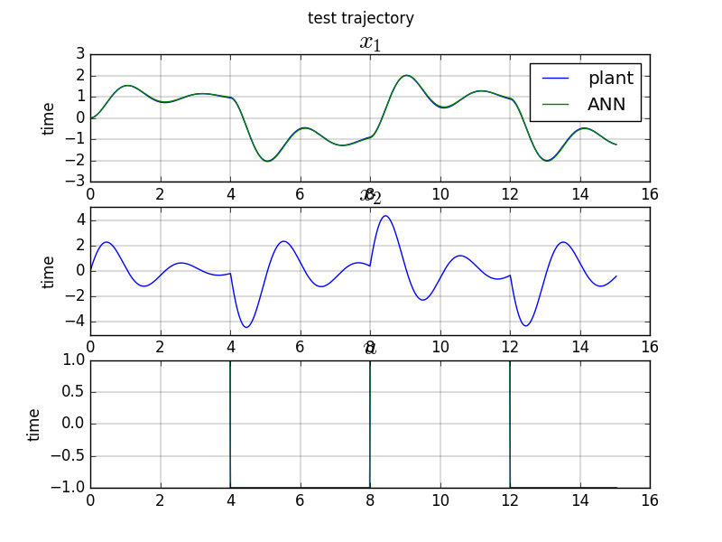

# System Identification of a Second Order Linear Time Invariant (LTI) Plant 

## Full State Access

We [recall](plant__so_lti.html) that the state space representation for a discrete time second order LTI plant is :

$$
\begin{pmatrix}x_1 \\ x_2 \end{pmatrix}_{k+1} = 
\begin{pmatrix} a_{11} & a_{12} \\ a_{21} & a_{22}\end{pmatrix} \begin{pmatrix}x_1 \\ x_2 \end{pmatrix}_{k} +
\begin{pmatrix} b_{1} \\ b_{2} \end{pmatrix} \begin{pmatrix} u \end{pmatrix}_{k}
$$
 
 or

$$
\begin{pmatrix}x_1 \\ x_2 \end{pmatrix}_{k+1} = 
\begin{pmatrix} a_{11} & a_{12} & b_1 \\ a_{21} & a_{22} & b_2 \end{pmatrix} \begin{pmatrix}x_1 \\ x_2 \\ u \end{pmatrix}_{k}
$$
 
We notice that this is also the equation for a single layer ANN with 3 inputs, 2 outputs, no bias and a linear activation function.
 
[sklearn code](https://github.com/poine/ann_elucubrations/blob/master/src/plant_id__so_lti__fs__sklearn.py)
<figure>
  
  <figcaption>Fig1. - SO LTI test trajectory, Full State Plant Identification.</figcaption>
</figure>

[keras code](https://github.com/poine/ann_elucubrations/blob/master/src/plant_id__so_lti__fs__keras.py)
<figure>
  
  <figcaption>Fig1. - SO LTI test trajectory, Full State Plant Identification.</figcaption>
</figure>

## Input/Output Access

$$
\theta_{k+1} = f(\theta_k, \theta_{k-1}, u_k, u_{k-1})
$$

As our plant is linear, $$f$$ can be written

$$
\theta_{k+1} = -b_1.\theta_k -b_0.\theta_{k-1} + a_1.u_k + a_0.u_{k-1}
$$

which leads to the following transfer function

$$
\frac{\theta(z)}{u(z)} = \frac{a_1.z+a_0}{z^2+b_1.z+b_0}
$$

[sklearn code](https://github.com/poine/ann_elucubrations/blob/master/src/plant_id__so_lti__io__sklearn.py)

<figure>
  
  <figcaption>Fig1. - SO LTI test trajectory, Input/Output Plant Identification with sklearn.</figcaption>
</figure>

[keras code](https://github.com/poine/ann_elucubrations/blob/master/src/plant_id__so_lti__io__keras.py)

<figure>
  
  <figcaption>Fig1. - SO LTI test trajectory, Input/Output Plant Identification with KERAS.</figcaption>
</figure>

##  Control Affine Form, Full State Identification

[keras code](https://github.com/poine/ann_elucubrations/blob/master/src/plant_id__so_lti__ctaf_fs__sklearn.py)

<figure>
  
  <figcaption>Fig1. - SO LTI test trajectory, Input/Output Control Affine Plant Identification.</figcaption>
</figure>

##  Control Affine Form, Input/Output Identification

$$
\theta_{k+1} = f(\theta_k, \theta_{k-1}, u_{k-1}) + g(\theta_k, \theta_{k-1}, u_{k-1}).u_k
$$

[keras code](https://github.com/poine/ann_elucubrations/blob/master/src/plant_id__so_lti__ctaf__sklearn.py)

<figure>
  
  <figcaption>Fig1. - SO LTI test trajectory, Input/Output Control Affine Plant Identification.</figcaption>
</figure>

