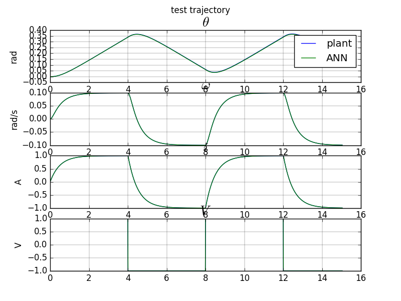
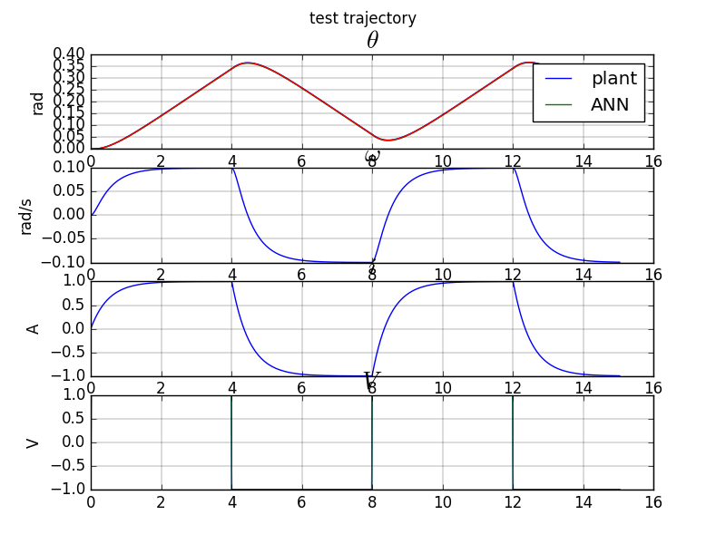
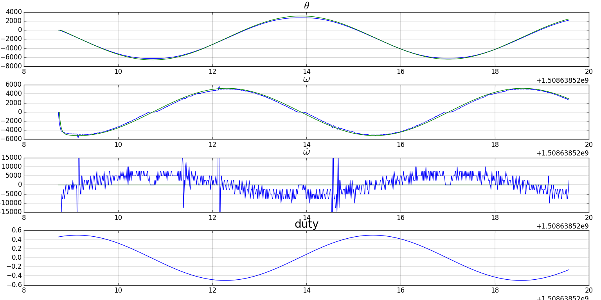

DC Motor Plant Identification

### Simulation

[code](https://github.com/poine/ann_elucubrations/blob/master/src/dc_motor_plant_id__sim_fs.py)

<figure>
  
  <figcaption>Fig1. - DC Motor test trajectory, Full state plant identification.</figcaption>
</figure>

[code](https://github.com/poine/ann_elucubrations/blob/master/src/dc_motor_plant_id__sim_io.py)
<figure>
  
  <figcaption>Fig1. - DC Motor test trajectory, IO plant identification.</figcaption>
</figure>

### Experimentation
[code](https://github.com/poine/ann_elucubrations/blob/master/src/dc_motor_plant_id_tmp.py)
<figure>
  
  <figcaption>Fig1. - DC Motor test trajectory, IO plant identification.</figcaption>
</figure>

### Bibliography

 * (1) [Adaptive Control of a DC Motor Using Neural Network Sliding Mode Control](http://www.iaeng.org/publication/IMECS2009/IMECS2009_pp1203-1207.pdf), M.Fallahi and S.Azadi,
 * (2) [Control Tutorial](http://ctms.engin.umich.edu/CTMS/index.php?example=MotorSpeed&section=SystemModeling), University of Michigan
