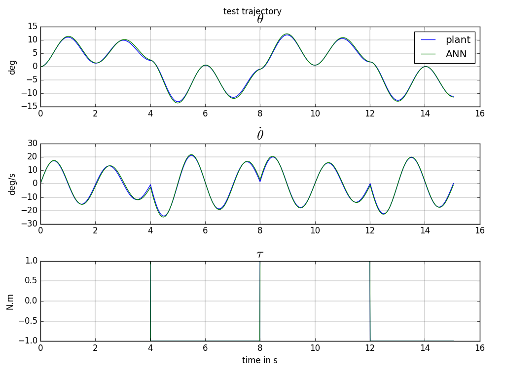
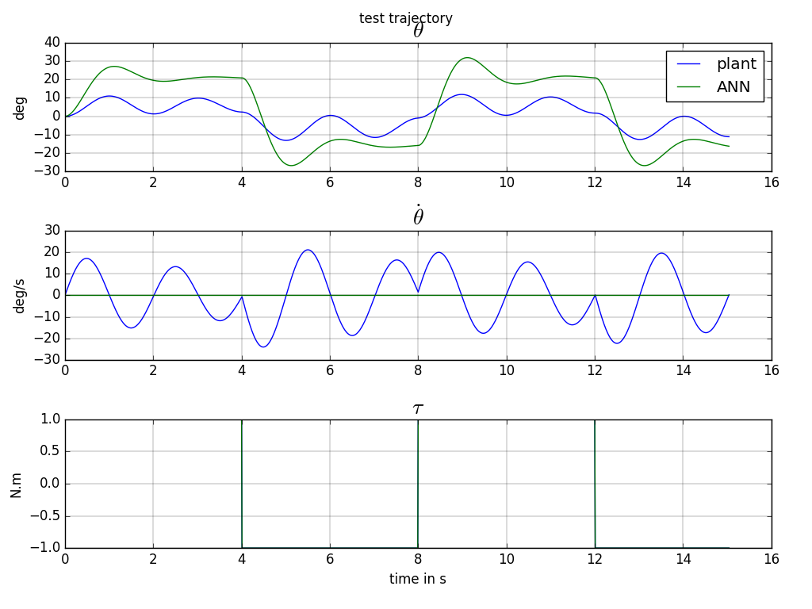

Robot Arm Plant Identification

### Full State

$$
\begin{pmatrix} \theta \\ \dot{\theta} \end{pmatrix}_{k+1} = f\left( \theta_k,  \dot{\theta}_k, u_k \right)
$$

[code](https://github.com/poine/ann_elucubrations/blob/master/src/plant_id__robot_arm__fs.py)

<figure>
  
  <figcaption>Fig1. - Robot Arm trajectory.</figcaption>
</figure>

### Input/Output

$$
\theta_{k+1} = f\left( \theta_k,  \theta_{k-1}, u_k, u_{k-1} \right)
$$

<figure>
  
  <figcaption>Fig2. - Robot Arm trajectory.</figcaption>
</figure>
