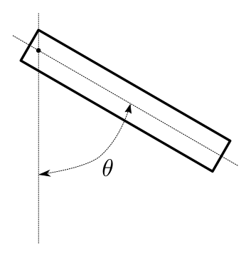

# Robot Arm

### Description
The single joint `Robot Arm` (or pendulum) is a classic example used in control theory. It consists in a solid rotating around a fixed axis. It is controlled by a torque applied to the rotation axis. It's a mildly non linear second order system.

<figure>
  
  
  <figcaption>Fig1. - Robot Arm Picture (left) and Schematics (right).</figcaption>
</figure>

### Model

$$
X = \begin{pmatrix} \theta \\ \dot{\theta}\end{pmatrix} \quad U = \begin{pmatrix} \tau\end{pmatrix}
$$

Using Physical parameters, the dynamic can be written as:

$$
 \frac{d}{dt}\begin{pmatrix} \theta \\ \dot{\theta} \end{pmatrix} = 
 \begin{pmatrix}  \dot{\theta} \\ \frac{1}{J} \left( -m.g.l.\sin{\theta} - b.\dot{\theta} + \tau \right) \end{pmatrix}
$$

The dynamic can be abstractly rewritten as 

$$
 \frac{d}{dt}\begin{pmatrix} \theta \\ \dot{\theta} \end{pmatrix} = 
 \begin{pmatrix}  \dot{\theta} \\ -a.\sin{\theta} -b.\dot{\theta} + c.\tau \end{pmatrix}
$$

Figure (2) shows a simulation of the model, obtained with this [code](https://github.com/poine/ann_elucubrations/blob/master/src/robot_arm.py).

<figure>
  
  <figcaption>Fig2. - Robot Arm trajectory.</figcaption>
</figure>
